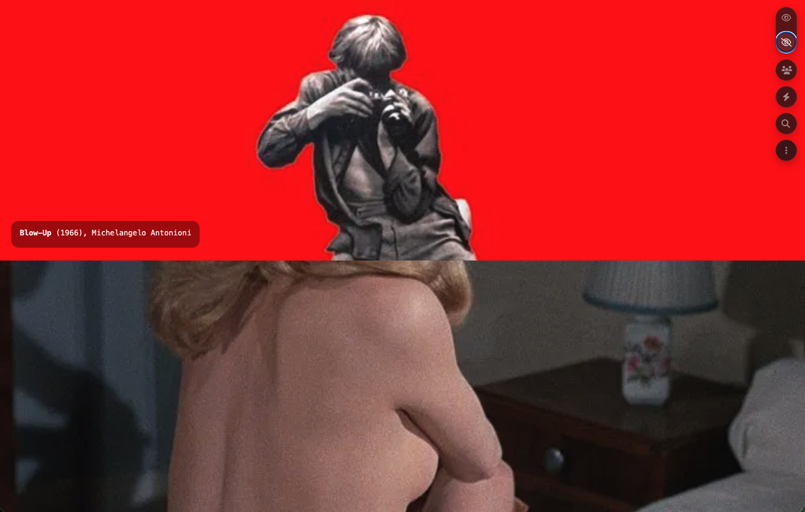
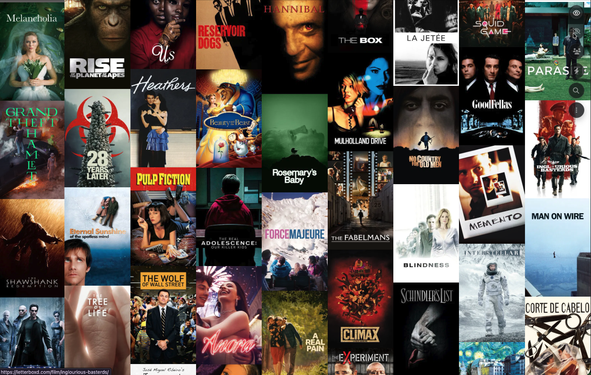

# have i seen it (or should we watch it)

Browse your Letterboxd watchlist, one film at a time.




## Overview

have i seen it fetches a Letterboxd user's watchlist and presents the films in two interactive views — a sequential full-screen feed and a responsive grid. Poster images are pulled from TMDB, and the interface works on both desktop and mobile.

## Features

- **Full view** — sequential film feed, scroll through one at a time
- **Slot view** — responsive grid (2–11 columns depending on viewport)
- **Search** — full-text search across the watchlist
- **TMDB posters** — high-quality poster images via TMDB
- **Mobile optimised** — limited to 40 entries on small screens
- **Data sources** — live Letterboxd scraping + Google Sheets fallback

## Tech Stack

- Node.js 20 (no framework)
- Vanilla JavaScript and CSS
- Letterboxd web scraping
- TMDB API for images
- Google Sheets CSV export

## Getting Started

**Prerequisites:** Node.js 20

```bash
npm start
```

Open [http://localhost:8080](http://localhost:8080), then enter a Letterboxd username.

## API

```
GET /api/watchlist?user=<letterboxd_username>
```

Returns an array of Letterboxd film URIs for the given user's watchlist. Responses are cached for 5 minutes.

## Deployment

Deployed on [Fly.io](https://fly.io) via `fly.toml`. A `Dockerfile` is included for container builds.

```bash
fly deploy
```

Live at: https://haveiwatchit.fly.dev/

Also available at: [ritapatacas.github.io/haveiseenit](https://ritapatacas.github.io/haveiseenit/)

## Project Structure

```
app/
  scripts/
    common/       # Shared utilities (data fetching, constants, TMDB)
    view/
      full/       # Full-screen feed view
      slot/       # Grid view
  styles/         # CSS for each view
server/
  server.js                           # HTTP server + static file serving
  fetch_letterboxd_user_watchlist.js  # Letterboxd scraper
index.html
Dockerfile
fly.toml
```
